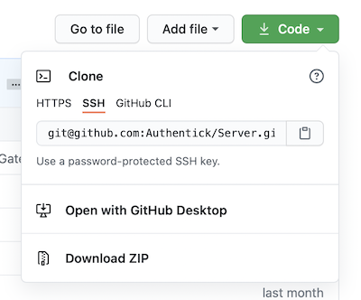

# Setup developer environment

You can get a running development environment in less than 5 minutes by using Visual Studio Code Containers. You can do so either locally or using GitHub codespaces \(which does offer a Cloud IDE\).

### Locally

Follow the [Visual Studio Code guide](https://code.visualstudio.com/docs/remote/containers#_quick-start-open-a-git-repository-or-github-pr-in-an-isolated-container-volume%20) and as GitHub URL type `Authentick/Server`. This will setup all docker containers up locally and configure your development environment.

### GitHub Codespaces

Just start a new codespace from the `main` branch. This will setup all containers in the cloud for you and offer you an IDE accessibly via browser.

