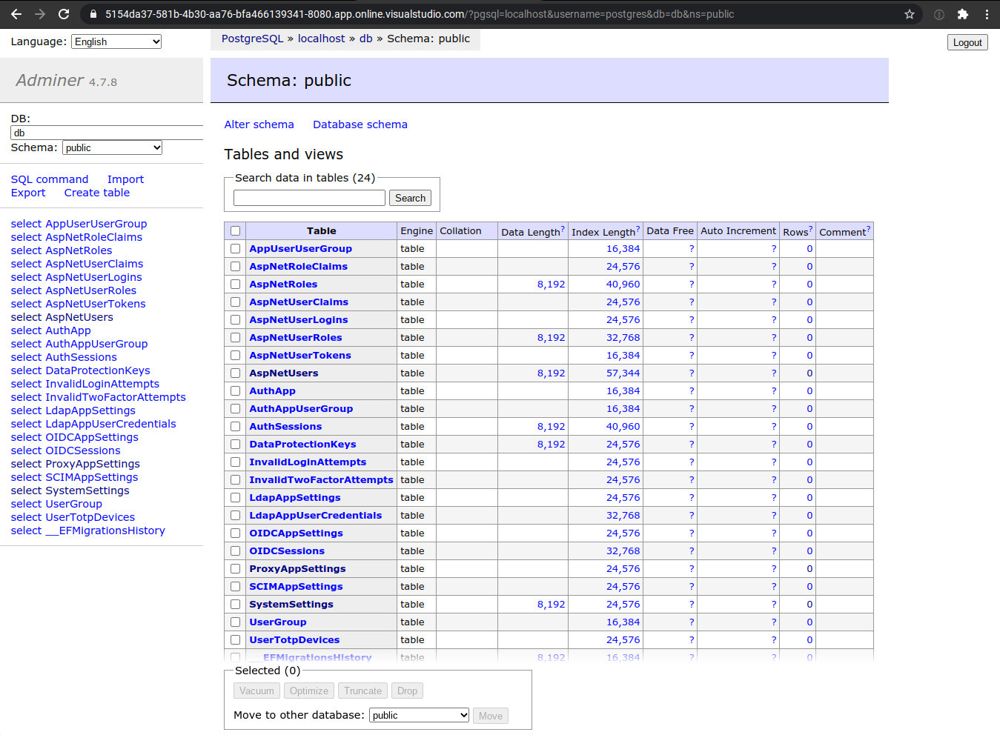

# Database

Authentick uses Entity Framework Core to interact with all data. The tutorial provided by Microsoft provides a lot of references:



As a underlying database we do use PostgreSQL using Npgsql. But this is an implementation detail that you likely don't have to deal with.

## Adminer

We include "Adminer" in the development environment which offers a web interface to the included database. 



To use Adminer, open your web browser and connect to port 8080 of your development server. For login, use the following information:

* **System:** PostgreSQL
* **Server:** localhost
* **User:** postgres
* **Password:** example

The database that contains the Authentick data is called "db".

