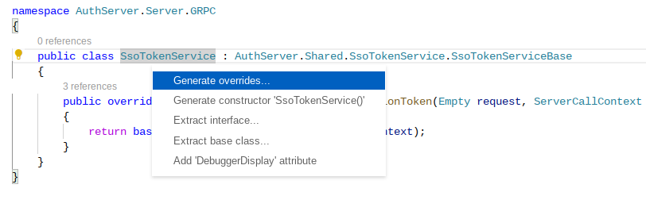

# gRPC services

The Gatekeeper server and client communicate using gRPC. To add a new service, you have to follow a few steps:

1. Create the protocol buffer \(`.proto`\) file if there is not already one.
2. Register the `.proto` file
3. Implement the gRPC service on the server
4. Register the gRPC client on the client

## Server changes

The definitions are stored in the [`Shared/Protos/`](https://github.com/GetGatekeeper/Server/tree/main/Shared/Protos) folder. Either extend an existing file, or create a new one.

The ASP.NET Core documentation offers a good introduction:




Make sure to use the VS Code auto-completion to implement all overrides. This will save you quite some time.




## Client changes

Upon definition of the service in the server, you need to register the gRPC client in the Gatekeeper Client. This is done in [`Client/Program.cs`](https://github.com/GetGatekeeper/Server/blob/cae622e8b4a9bab505f575c974924eb06dbec648/Client/Program.cs#L23-L33), below you see some clients being registered:

```csharp
namespace AuthServer.Client
{
    public class Program
    {
        public static async Task Main(string[] args)
        {
            var builder = WebAssemblyHostBuilder.CreateDefault(args);

            builder.Services.AddScoped(sp => new HttpClient { BaseAddress = new Uri(builder.HostEnvironment.BaseAddress) });

            builder.Services.AddScoped(services => { return new AuthServer.Shared.Typeahead.TypeaheadClient(GetGrpcChannel(services)); });
            builder.Services.AddScoped(services => { return new AuthServer.Shared.Auth.AuthClient(GetGrpcChannel(services)); });
            builder.Services.AddScoped(services => { return new AuthServer.Shared.Security.Settings.SettingsClient(GetGrpcChannel(services)); });
            builder.Services.AddScoped(services => { return new AuthServer.Shared.Security.Sessions.SessionsClient(GetGrpcChannel(services)); });
            builder.Services.AddScoped(services => { return new AuthServer.Shared.Admin.Users.UsersClient(GetGrpcChannel(services)); });
            builder.Services.AddScoped(services => { return new AuthServer.Shared.Admin.AdminApps.AdminAppsClient(GetGrpcChannel(services)); });
            builder.Services.AddScoped(services => { return new AuthServer.Shared.Admin.Groups.GroupsClient(GetGrpcChannel(services)); });
            builder.Services.AddScoped(services => { return new AuthServer.Shared.Apps.Apps.AppsClient(GetGrpcChannel(services)); });
            builder.Services.AddScoped(services => { return new AuthServer.Shared.Install.InstallClient(GetGrpcChannel(services)); });
            builder.Services.AddScoped(services => { return new AuthServer.Shared.UserProfile.UserProfileClient(GetGrpcChannel(services)); });
            builder.Services.AddScoped(services => { return new AuthServer.Shared.OIDCUserService.OIDCUserServiceClient(GetGrpcChannel(services)); });
```

Upon registration you can inject the client in your Razor files, and use it \([example](https://github.com/GetGatekeeper/Server/blob/cae622e8b4a9bab505f575c974924eb06dbec648/Client/Pages/Apps/AppsDetails.razor)\):

```csharp
@page "/apps/details/{Id:guid}"
@attribute [Authorize]

@layout AppShell

@using AuthServer.Shared.Apps

@inject AuthServer.Shared.Apps.Apps.AppsClient AppsClient

@if(appReply != null) {
    <h2>@appReply.Name</h2>
}

@code {
    [Parameter]
    public Guid Id { get; set; }

    private GetAppDetailsReply? appReply;
    private String newLdapPassword;

    protected override async Task OnInitializedAsync()
    {
        GetAppDetailsRequest request = new GetAppDetailsRequest {
            Id = Id.ToString(),
        };

        appReply = await AppsClient.GetAppDetailsAsync(request);
    }
}
```

